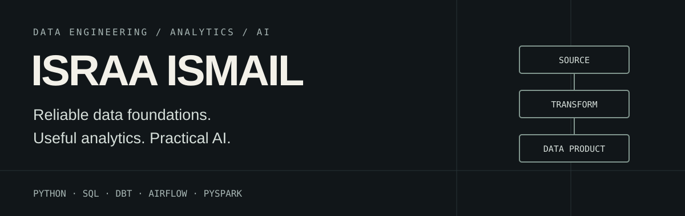

  

  <a href="https://www.linkedin.com/in/israa-ismail-ii">LinkedIn</a> ·
  <a href="https://medium.com/@israa.ismail8i4">Writing</a> ·
  <a href="https://github.com/IIsmail15?tab=repositories">Repositories</a>

# Building data systems that make analytics and AI possible.

**Data Engineer · Analytics Engineering · AI**

I turn messy operational data into reliable, usable data products. My experience spans 5+ years across analytics, automation and technical delivery, alongside an MSc in Data Science. I start with the business problem and work through ingestion, transformation and delivery.

## Selected work

### 01 / Car Rental Data Platform
**From simulated transactions to an analytics-ready warehouse.**

An end-to-end platform modelling a UK car rental business. Python generates source data, PostgreSQL holds the operational tables, and dbt builds a star schema for analysing revenue, fleet usage and rental activity.

**Architecture:** Python / Faker → PostgreSQL staging → dbt → dimensional warehouse  
**Stack:** Python · SQLAlchemy · PostgreSQL · dbt · Neon

[Explore the platform →](https://github.com/IIsmail15/car-rental-data-platform)

---

### 02 / Industrial Defect Analysis
**Connecting production conditions with manufacturing quality.**

Combines PLC sensor measurements with metal coil defect records to investigate which process variables are associated with defects. The work spans data alignment, preprocessing, feature exploration and machine learning.

**Workflow:** Sensor data + defect records → alignment → features → modelling  
**Stack:** Python · pandas · scikit-learn · Jupyter

[Explore the analysis →](https://github.com/IIsmail12/ML-Project)

---

### 03 / Hospital Readmission ETL
**Turning raw healthcare data into structured analytical outputs.**

A PySpark pipeline that cleans hospital admission data, transforms demographic and diagnosis fields, and exports Parquet datasets for exploring 30-day readmission patterns.

**Workflow:** Raw CSV → PySpark transformations → Parquet → readmission analysis  
**Stack:** Python · PySpark · Docker · JupyterLab

[Explore the pipeline →](https://github.com/IIsmail15/spark-hospital-readmission-etl)

---

### 04 / LLaMA of Wall Street
**Structured company extraction from noisy financial discussion.**

A team project on Leonardo HPC that turns Reddit comments into daily stock sentiment signals. **My contribution focused on ticker extraction:** Mistral inference, Pydantic structured output, parallel requests and a keyword fallback. The wider pipeline combines extraction with RoBERTa sentiment scoring and downstream visualisation.

**Architecture:** Reddit comments → ticker extraction → sentiment scoring → daily signals  
**Stack:** Mistral · vLLM · Pydantic · Python · SLURM

[Explore the team project →](https://github.com/IIsmail12/cineca-project)

<strong>More work / Crypto ETL with Airflow</strong>

A daily Airflow DAG that extracts cryptocurrency market data from CoinGecko, transforms JSON into tabular data, and handles loading in a Docker Compose environment.

**Stack:** Airflow · Python · CoinGecko API · PostgreSQL · Docker

[Explore the repository →](https://github.com/IIsmail15/crypto_etl_dag)

## Technical toolkit

| Area | Tools |
| :--- | :--- |
| Data engineering | Python, SQL, dbt, Airflow, PySpark |
| Databases & platforms | PostgreSQL, Snowflake, MongoDB, Azure |
| Delivery | Docker, Git, GitHub |
| Analytics & AI | Power BI, Streamlit, NLP, LLMs |

## Current focus

- Reliable pipelines and clear dimensional models.
- Analytics engineering that connects business questions to usable data.
- Practical LLM applications with structured outputs and validation.
- Cloud and distributed processing.

## Writing & connection

I write about the work behind useful data systems on [Medium](https://medium.com/@israa.ismail8i4).

**Open to opportunities in Data Engineering, Analytics Engineering and AI.**  
[Connect with me on LinkedIn →](https://www.linkedin.com/in/israa-ismail-ii)
